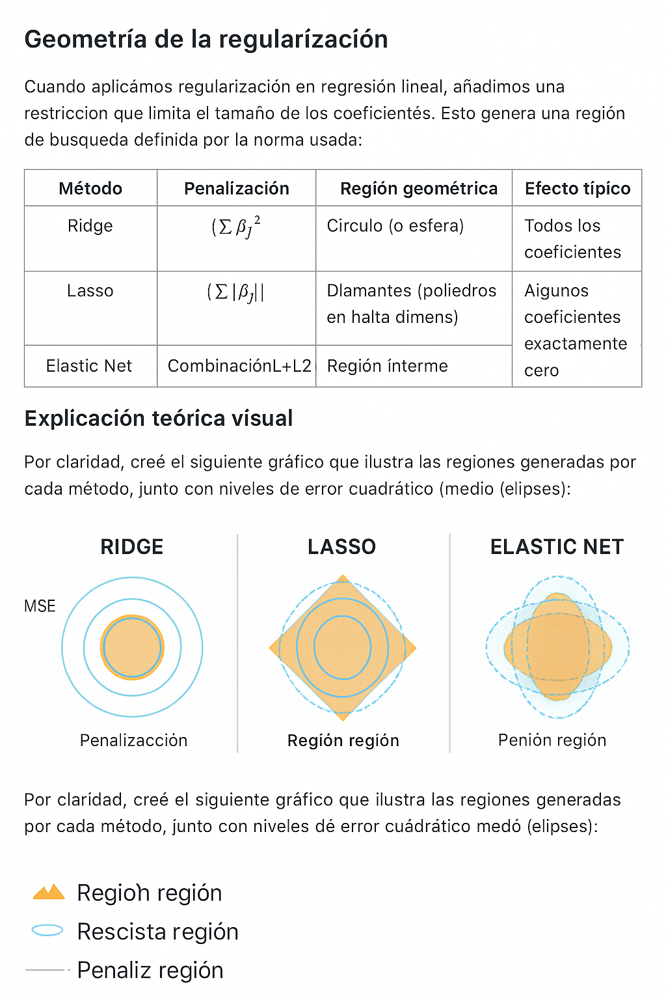

# 📊 Regresiones Regularizadas: Ridge, Lasso y Elastic Net

Este repositorio contiene una unidad completa sobre regresión regularizada en modelos lineales, orientada a estudiantes de maestría y profesionales en ciencia de datos y modelación matemática.

---

## 📁 Contenido del repositorio

| Archivo | Descripción |
|--------|-------------|
| `regresion_regularizada_completa.ipynb` | Notebook integral con teoría, aplicación y comparación de Ridge, Lasso y Elastic Net |
| `ridge_regression.ipynb` | Teoría, visualización e implementación completa de **Regresión Ridge** |
| `lasso_regression.ipynb` | Teoría e implementación de **Regresión Lasso**, con enfoque en selección de variables |
| `elasticnet_regression.ipynb` | Análisis de **Elastic Net**, mostrando cómo combina Ridge y Lasso |
| `comparacion_modelos_regularizados.ipynb` | Comparación práctica y gráfica entre los tres modelos |
| `graficos_regularizacion/` | Imágenes explicativas sobre las regiones geométricas de cada modelo |
| `geometria_regularizacion.md` | Explicación detallada sobre la geometría de la regularización |

---

## 🎯 Objetivos de aprendizaje

- Comprender las limitaciones de la regresión OLS y cómo la regularización las mitiga.
- Conocer el fundamento teórico y geométrico de Ridge, Lasso y Elastic Net.
- Aplicar cada técnica en un ejemplo real, analizar sus coeficientes y evaluar su rendimiento.
- Validar los supuestos del modelo usando análisis de residuos.
- Comparar los tres métodos y justificar su elección en problemas reales.

---

## 🧠 Geometría de la regularización

Cuando aplicamos regularización en regresión lineal, añadimos una restricción que **limita el tamaño de los coeficientes**. Esta restricción impone una región geométrica que depende de la norma utilizada:

| Método         | Penalización               | Región geométrica      | Efecto típico                               |
|----------------|----------------------------|-------------------------|---------------------------------------------|
| **Ridge**      | \( \sum \beta_j^2 \)       | Círculo / Esfera        | Coeficientes pequeños, ninguno exactamente cero |
| **Lasso**      | \( \sum |\beta_j| \)       | Rombos / Poliedros      | Algunos coeficientes exactamente cero       |
| **Elastic Net**| \( \alpha L1 + (1 - \alpha) L2 \) | Región intermedia | Combinación de selección y estabilidad      |

📌 El punto óptimo se encuentra donde la elipse de error (función de pérdida) toca esta región de penalización:



> Las formas geométricas ayudan a entender por qué **Lasso tiende a eliminar variables** (vértices angulados del rombo) y **Ridge las conserva pequeñas** (borde suave de la esfera).

🔍 Para una explicación más profunda, incluyendo fórmulas, teoría y bibliografía, consulta el archivo:

📄 [`geometria_regularizacion.md`](geometria_regularizacion.md)

---

## ⚙️ Tecnologías utilizadas

- Python 3.11
- Scikit-learn
- Numpy, Matplotlib, Seaborn
- Statsmodels, Scipy

---

## 🚀 Ejecutar en línea

- [Notebook completo en Colab](https://colab.research.google.com/github/RobertoSam/Regresion-Regularizada/blob/main/regresion_regularizada_completa_final.ipynb)
- [Abrir Ridge en Google Colab](https://colab.research.google.com/github/RobertoSam/Regresion-Regularizada/blob/main/ridge_regression.ipynb)
- [Abrir Lasso en Colab](https://colab.research.google.com/github/RobertoSam/Regresion-Regularizada/blob/main/lasso_regression.ipynb)
- [Abrir Elastic Net en Colab](https://colab.research.google.com/github/RobertoSam/Regresion-Regularizada/blob/main/elasticnet_regression.ipynb)
- [Comparación en Colab](https://colab.research.google.com/github/RobertoSam/Regresion-Regularizada/blob/main/comparacion_modelos_regularizados.ipynb)

---

## 🛠 Instalación local rápida

1. Clona este repositorio:
```bash
git clone https://github.com/RobertoSam/Regresion-Regularizada.git
cd Regresion-Regularizada
```

2. Crea un entorno virtual (opcional pero recomendado):
```bash
python -m venv venv
source venv/bin/activate  # En Windows: venv\Scripts\activate
```

3. Instala las dependencias:
```bash
pip install -r requirements.txt
```

4. Abre los notebooks:
```bash
jupyter notebook
```

---

## 📚 Aplicaciones actuales

Las técnicas de regresión regularizada se usan ampliamente en:

- Genómica y biología computacional
- Marketing predictivo
- Selección de variables en modelos con alta dimensionalidad
- Modelos de series temporales con múltiples covariables

---

## 👨‍🏫 Autor

Material desarrollado por **Roberto Sam** para la Maestría en Modelización Matemática y Computacional – Universidad Nacional de Ingeniería (UNI), Perú.  
Asistencia técnica y didáctica desarrollada con ayuda de un asistente académico especializado en matemáticas aplicadas y ciencia de datos.
