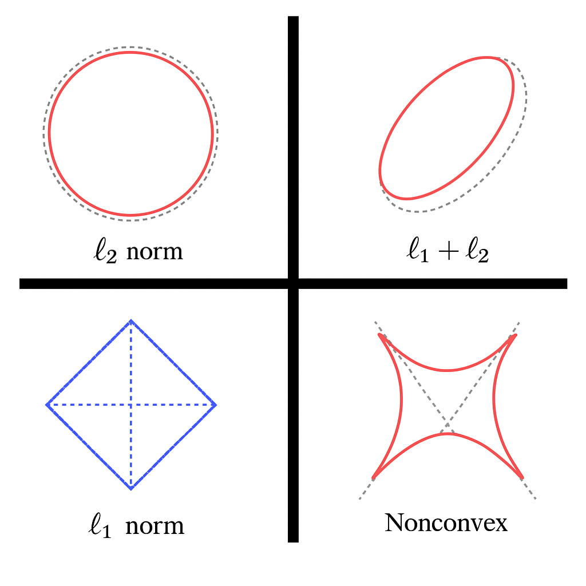

# 📊 Regresiones Regularizadas: Ridge, Lasso y Elastic Net

Este repositorio contiene una unidad completa sobre regresión regularizada en modelos lineales, orientada a estudiantes de maestría y profesionales en ciencia de datos y modelación matemática.

---

## 📁 Contenido del repositorio

| Archivo | Descripción |
|--------|-------------|
| `regresion_regularizada_completa.ipynb` | Notebook integral con teoría, aplicación y comparación de Ridge, Lasso y Elastic Net |
| `graficos_regularizacion/` | Imágenes explicativas sobre las regiones geométricas de cada modelo |

---

## 🎯 Objetivos de aprendizaje

- Comprender las limitaciones de la regresión OLS y cómo la regularización las mitiga.
- Conocer el fundamento teórico y geométrico de Ridge, Lasso y Elastic Net.
- Aplicar cada técnica en un ejemplo real, analizar sus coeficientes y evaluar su rendimiento.
- Validar los supuestos del modelo usando análisis de residuos.
- Comparar los tres métodos y justificar su elección en problemas reales.

---

## 🧠 Geometría de la regularización



---

## ⚙️ Tecnologías utilizadas

- Python 3.11
- Scikit-learn
- Numpy, Matplotlib, Seaborn
- Statsmodels, Scipy

---

## 🛠 Instalación local rápida

1. Clona este repositorio:
```bash
git clone https://github.com/RobertoSam/Regresion-Regularizada.git
cd Regresion-Regularizada
```

2. Crea un entorno virtual (opcional pero recomendado):
```bash
python -m venv venv
source venv/bin/activate  # En Windows: venv\Scripts\activate
```

3. Instala las dependencias:
```bash
pip install -r requirements.txt
```

4. Abre los notebooks:
```bash
jupyter notebook
```

---

## 👨‍🏫 Autor

Material desarrollado por **Roberto Sam** para la Maestría en Modelización Matemática y Computacional – Universidad Nacional de Ingeniería (UNI), Perú.  
Asistencia técnica desarrollada con ayuda de un asistente académico especializado en matemáticas aplicadas y ciencia de datos.
