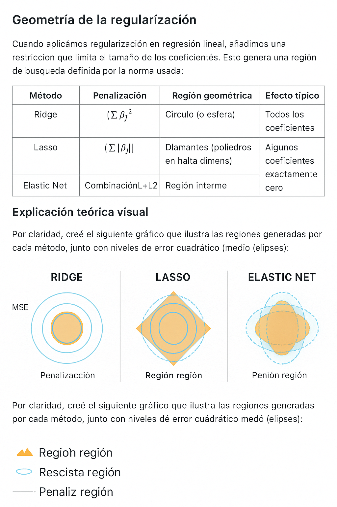

# 🧠 Geometría de la Regularización

Las técnicas de regresión regularizada imponen restricciones geométricas sobre los coeficientes del modelo. Estas restricciones se traducen en **regiones factibles** que influyen en la forma en que se encuentran las soluciones óptimas.

---

## 🎨 Comparación geométrica

Este gráfico muestra las regiones de penalización para cada método:

- 🔵 **Ridge**: penaliza con la norma L2 → región **circular**  
  Favorece coeficientes pequeños pero no exactamente cero.  
  ➕ Bueno para **multicolinealidad**.

- ◼️ **Lasso**: penaliza con la norma L1 → región **romboidal**  
  Tiende a empujar coeficientes exactamente a cero.  
  ➕ Útil para **selección de variables**.

- 🔷 **Elastic Net**: mezcla L1 + L2 → región **intermedia**  
  Combina esparsidad con estabilidad.  
  ➕ Eficiente cuando hay **muchas variables correlacionadas**.

---

## 🎯 ¿Por qué importa la geometría?

El punto óptimo del modelo (mínimo del error cuadrático) se ve modificado por estas regiones:

- En **Ridge**, el mínimo se proyecta dentro del círculo → coeficientes pequeños.
- En **Lasso**, el mínimo puede "chocar" con los vértices del rombo → coeficientes cero.
- En **Elastic Net**, la solución transita entre ambas geometrías.

Estas formas geométricas explican visualmente **cómo y por qué** cada técnica actúa diferente.

---

## 📚 Referencias recomendadas

- Hastie, T., Tibshirani, R., & Friedman, J. (2009). *The Elements of Statistical Learning*.
- James, G., Witten, D., Hastie, T., & Tibshirani, R. (2013). *An Introduction to Statistical Learning*.
- Zou, H., & Hastie, T. (2005). Regularization and variable selection via the elastic net.

---
